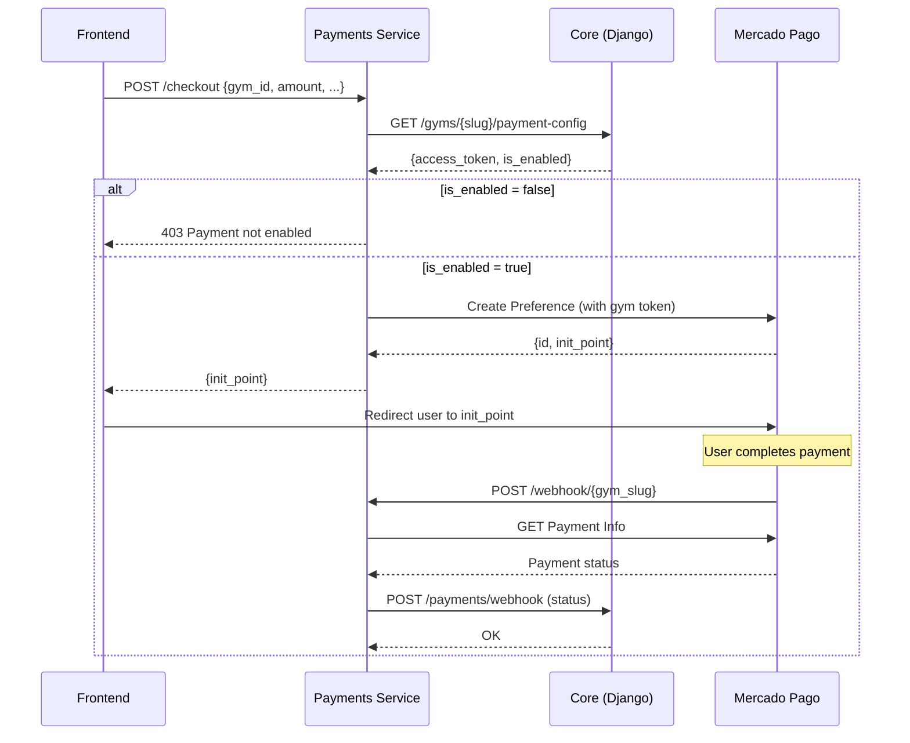

# FitStack Payments Microservice

Microservicio de pagos para FitStack SaaS. Procesa pagos mediante Mercado Pago actuando como pasarela multi-tenant.

## Arquitectura

```
┌─────────────────────────────────────────────────────────────────┐
│                         FitStack Frontend                        │
└─────────────────────────────────────────────────────────────────┘
                              │
                    POST /api/v1/payments/checkout
                              │
                              ▼
┌─────────────────────────────────────────────────────────────────┐
│                    fitstack-payments (Go)                        │
│  ┌─────────────┐  ┌─────────────┐  ┌─────────────────────────┐  │
│  │   Handlers  │→ │   Service   │→ │      Domain Layer       │  │
│  │  (Gin API)  │  │  (Logic)    │  │  (Entities/Interfaces)  │  │
│  └─────────────┘  └─────────────┘  └─────────────────────────┘  │
│         │               │                      ▲                 │
│         │               │                      │                 │
│         │    ┌──────────┴──────────┐          │                 │
│         │    │  Infrastructure     │──────────┘                 │
│         │    │  ├─ mercadopago/    │                            │
│         │    │  └─ fitstack_core/  │                            │
│         │    └─────────────────────┘                            │
└─────────│───────────────────────────────────────────────────────┘
          │                    │
          │                    ▼
          │         ┌─────────────────┐
          │         │ FitStack Core   │
          │         │  (Django API)   │
          │         └─────────────────┘
          │
          ▼
┌─────────────────┐
│  Mercado Pago   │
│      API        │
└─────────────────┘
```

## Requisitos

- **Go 1.22+** (ver instrucciones de instalación abajo)
- **WSL** (Ubuntu recomendado)
- Acceso a FitStack Core API
- Credenciales de Mercado Pago por gimnasio

## Instalación de Go en WSL

```bash
# Ejecutar el script de instalación
chmod +x scripts/setup_go_wsl.sh
./scripts/setup_go_wsl.sh

# Aplicar cambios
source ~/.bashrc

# Verificar instalación
go version
```

## Configuración

Copiar `.env.example` a `.env` y configurar las variables:

```bash
cp .env.example .env
```

### Variables de Entorno

| Variable | Descripción | Requerida | Default |
|----------|-------------|-----------|---------|
| `PORT` | Puerto del servidor HTTP | No | `8080` |
| `GIN_MODE` | Modo de Gin (`debug`, `release`) | No | `debug` |
| `FITSTACK_CORE_URL` | URL base del Core API | **Sí** | - |
| `FITSTACK_CORE_API_KEY` | API Key para comunicación interna | **Sí** | - |
| `ENCRYPTION_KEY` | Clave de 32 bytes para encriptación | **Sí** | - |
| `MP_WEBHOOK_SECRET` | Secret para validar webhooks de MP | No | - |

## Desarrollo

```bash
# Navegar al proyecto (en WSL)
cd /mnt/h/fitstack_payments

# Instalar dependencias
go mod tidy

# Ejecutar en modo desarrollo
go run cmd/api/main.go

# Compilar
go build -o bin/payments-api cmd/api/main.go

# Ejecutar tests
go test ./...
```

## API Endpoints

### `POST /api/v1/payments/checkout`

Crea una preferencia de pago en Mercado Pago.

**Request:**
```json
{
  "gym_id": "mi-gimnasio",
  "amount": 5000.00,
  "title": "Plan Mensual Premium",
  "payer_email": "cliente@email.com"
}
```

**Response (200 OK):**
```json
{
  "success": true,
  "init_point": "https://www.mercadopago.com.ar/checkout/v1/redirect?pref_id=..."
}
```

**Errores:**
- `403`: El gimnasio no tiene habilitada la integración de pagos
- `404`: Gimnasio no encontrado
- `400`: Datos de request inválidos

### `POST /webhook/:gym_slug`

Recibe notificaciones de Mercado Pago.

> Este endpoint es llamado directamente por Mercado Pago cuando hay actualizaciones de pago.

### `GET /health`

Health check del servicio.

```json
{
  "status": "ok",
  "service": "fitstack-payments"
}
```

## Estructura del Proyecto

```
fitstack_payments/
├── cmd/
│   └── api/
│       └── main.go           # Entry point
├── config/
│   └── config.go             # Configuración
├── docs/
│   └── api.md                # Documentación API
├── internal/
│   ├── api/
│   │   ├── handlers.go       # HTTP handlers
│   │   ├── middleware.go     # Middleware
│   │   └── router.go         # Rutas
│   ├── domain/
│   │   ├── entities.go       # Entidades
│   │   ├── errors.go         # Errores
│   │   └── repositories.go   # Interfaces
│   ├── payment/
│   │   └── service.go        # Lógica de negocio
│   └── platform/
│       ├── fitstack_core/
│       │   └── client.go     # Cliente Core
│       └── mercadopago/
│           └── adapter.go    # Adapter MP
├── scripts/
│   └── setup_go_wsl.sh       # Setup Go WSL
├── .env.example
├── go.mod
└── README.md
```

## Flujo de Pago



## Seguridad

- **JWT Validation**: Las requests al endpoint `/checkout` deben incluir un JWT válido de FitStack
- **Webhook Security**: Los webhooks de MP se validan mediante firma HMAC
- **Internal API**: La comunicación con Core usa API Key interna
- **Token Encryption**: Los tokens de MP se almacenan encriptados en Core

## Próximos Pasos

1. Implementar validación completa de JWT
2. Agregar tests unitarios y de integración
3. Configurar CI/CD
4. Agregar métricas y observabilidad
5. Implementar retry logic para webhooks fallidos
