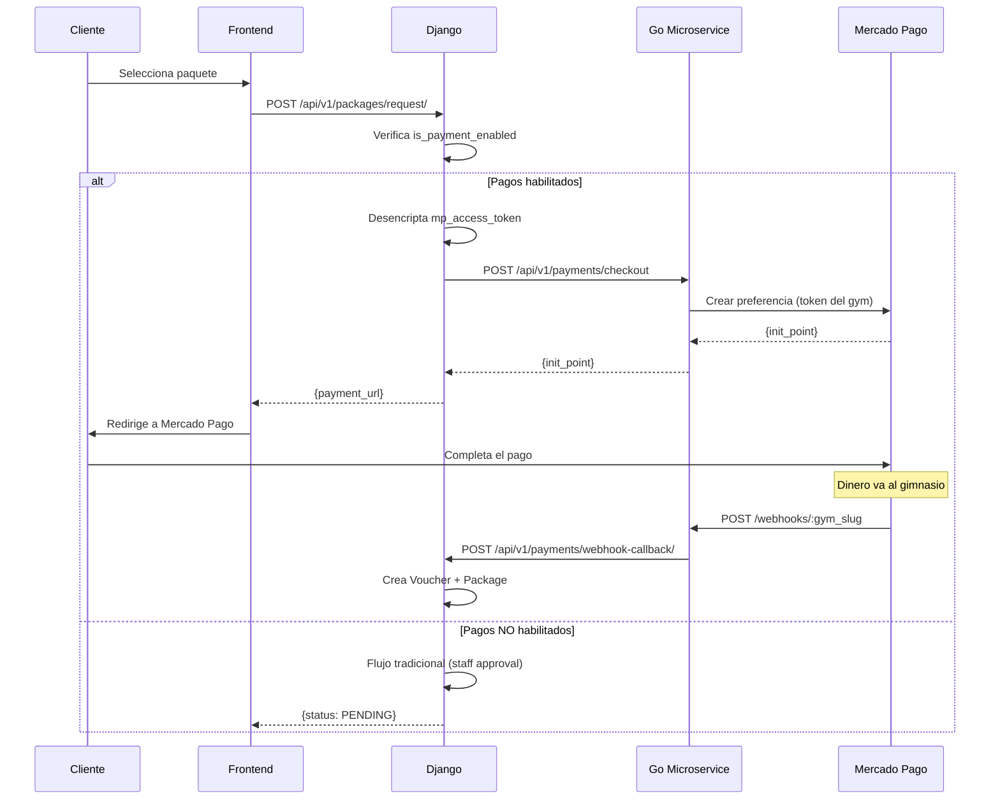

# FitStack Payments Integration

## Overview

Integración entre el microservicio de pagos en Go (`fitstack-payments`) y el backend principal de FitStack (Django) para procesamiento de pagos multi-tenant.

> [!IMPORTANT]
> Esta integración permite que **cada gimnasio reciba pagos directamente** en su cuenta de Mercado Pago. FitStack actúa solo como intermediario técnico.

---

## Business Model

```
┌─────────────────────────────────────────────────────────────┐
│                    FitStack Platform                         │
│              (Intermediario técnico solamente)               │
└─────────────────────────────────────────────────────────────┘
                              │
           ┌──────────────────┼──────────────────┐
           ▼                  ▼                  ▼
    ┌─────────────┐    ┌─────────────┐    ┌─────────────┐
    │  Level Gym  │    │ Sport Life  │    │  Iron Gym   │
    │             │    │             │    │             │
    │ Cuenta MP:  │    │ Cuenta MP:  │    │ Cuenta MP:  │
    │ @levelgym   │    │ @sportlife  │    │ @irongym    │
    └──────┬──────┘    └──────┬──────┘    └──────┬──────┘
           │                  │                  │
      Clientes pagan     Clientes pagan    Clientes pagan
```

---

## Roles y Permisos

| Rol | Acciones de Pago |
|-----|------------------|
| **Client** | Compra paquetes, es redirigido a MP |
| **Staff** | Ve estado de pagos |
| **Admin** | Configura credenciales MP del gym |
| **Superuser** | Habilita feature de pagos por gym |

---

## Flujo de Pago Completo



---

## Documentación Detallada

| Documento | Contenido |
|-----------|-----------|
| [api.md](./api.md) | Endpoints del microservicio Go |
| [DJANGO_INTEGRATION.md](./DJANGO_INTEGRATION.md) | Modelos, vistas y configuración Django |

---

## Quick Start

### 1. Django - Agregar campos al modelo Gym

```python
is_payment_enabled = models.BooleanField(default=False)
mp_access_token = models.TextField(blank=True, null=True)  # Encriptado
mp_webhook_secret = models.TextField(blank=True, null=True)  # Encriptado
```

### 2. Django - Variables de entorno

```env
PAYMENTS_SERVICE_URL=http://localhost:8080
PAYMENTS_SERVICE_API_KEY=your-service-key
INTERNAL_API_KEY=your-internal-key
PAYMENT_ENCRYPTION_KEY=<fernet-key>
```

### 3. Go Microservice - Variables de entorno

```env
PORT=8080
DJANGO_BACKEND_URL=http://localhost:8000
DJANGO_API_KEY=your-internal-key
```

### 4. Gym Admin - Configurar MP

```bash
POST /api/v1/gyms/:slug/payment-config/
{
  "mp_access_token": "APP_USR-xxx",
  "mp_webhook_secret": "xxx"
}
```

### 5. Cliente - Comprar paquete

```bash
POST /api/v1/packages/request/
→ Retorna payment_url si pagos habilitados
```

---

## Seguridad

| Dato | Almacenamiento | Notas |
|------|----------------|-------|
| Access Token | Encriptado (Fernet) | Solo descifrado para llamadas API |
| Webhook Secret | Encriptado (Fernet) | Usado para validar x-signature |
| Datos de tarjeta | Nunca almacenados | Manejados por Mercado Pago |

---

## Endpoints Resumen

### Go Microservice
- `POST /api/v1/payments/checkout` - Crear preferencia MP
- `POST /webhooks/:gym_slug` - Recibir IPN de MP
- `GET /health` - Health check

### Django Backend
- `POST /api/v1/gyms/:slug/payment-config/` - Configurar credenciales (Admin)
- `GET /api/v1/internal/gyms/:slug/credentials/` - Obtener creds (Internal)
- `POST /api/v1/payments/webhook-callback/` - Callback de pagos (Internal)
